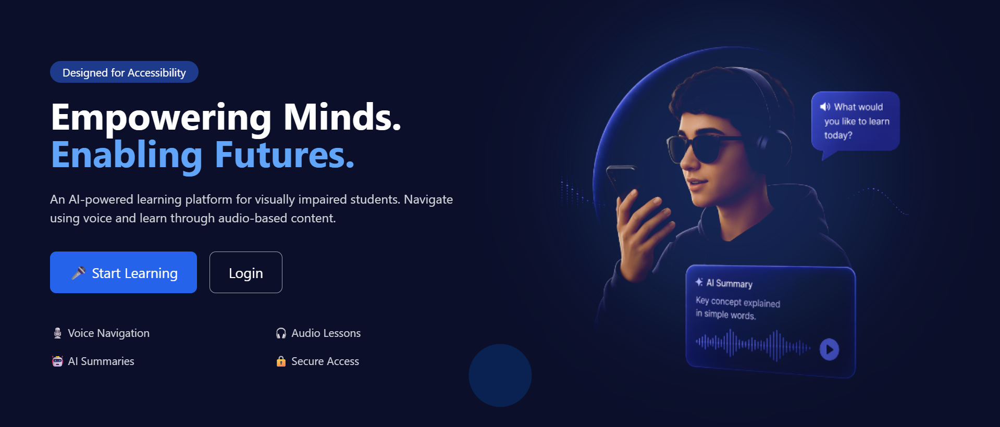
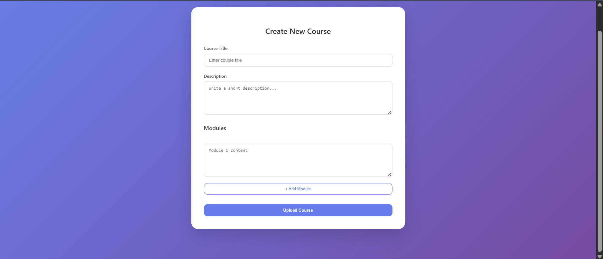

# ♿ Accessible Learning Platform for Visually Impaired

An AI-powered, accessibility-focused learning platform designed specifically for **visually impaired users**, enabling seamless interaction through **voice navigation, audio learning, and intelligent assistance**.

---

## 🌟 Overview

This project aims to bridge the digital learning gap by providing an **inclusive education system** where visually impaired users can independently access study materials, attempt quizzes, and interact with content using **voice commands and audio feedback**.

---

## 🖼️ Screenshots

### 🔹 Landing Page


### 🔹 Teacher Upload Dashboard


### 🔹 Admin Dashboard


---

## 🚀 Key Features

### 🗣️ Voice-Based Navigation
- Fully **hands-free navigation** using **Web Speech API**
- Users can **login, navigate, and interact** via voice commands
- Enhances usability without relying on visual interfaces

### 🔐 Smart Authentication
- **Face recognition login** for secure and quick access
- Voice-assisted username input for accessibility

### 🎧 Audio Learning System
- Users can **listen to study materials uploaded by teachers**
- Designed for **screen-free learning experience**

### 📝 Audio-Based Quizzes
- Attempt quizzes through **audio prompts**
- Voice-based responses for answering questions

### 🤖 AI Assistant
- Integrated **AI-powered assistant**
- Provides **content summarization** for better understanding
- Helps users quickly grasp key concepts

### 👨‍🏫 Teacher Module
- Teachers can:
  - Login via email/password
  - Upload study materials (audio/text)
  - Manage learning modules

### 🛡️ Admin Panel
- Admin approval system for:
  - Teacher registrations
  - Content moderation
- Ensures **quality and security of learning resources**

---

## 🛠️ Tech Stack

**Frontend**
- React.js
- Tailwind CSS

**Backend**
- Node.js
- Express.js

**Database**
- MongoDB

**APIs & Tools**
- Web Speech API (Voice Recognition & Synthesis)  
- Face Recognition APIs  
- AI/NLP APIs (for summarization)  

---

## 📂 Project Structure

```
Accessible-Learning-Platform/
│
├── backend/
│   ├── config/
│   │   └── db.js
│   ├── models/
│   │   ├── Course.js
│   │   └── User.js
│   ├── routes/
│   │   ├── admin.js
│   │   ├── aiRoutes.js
│   │   ├── auth.js
│   │   └── courses.js
│   └── services/
│       └── aiService.js
│
├── frontend/
│   ├── public/
│   ├── src/
│   │   ├── assets/
│   │   │   └── hero1.png
│   │   ├── components/
│   │   │   ├── AdminSidebar.jsx
│   │   │   ├── AIAssistant.jsx
│   │   │   └── VoiceFeedback.jsx
│   │   ├── pages/
│   │   │   ├── Home.js
│   │   │   ├── Login.js
│   │   │   ├── Register.jsx
│   │   │   ├── CourseList.js
│   │   │   ├── CourseDetail.js
│   │   │   ├── Profile.js
│   │   │   ├── AdminDashboard.jsx
│   │   │   ├── TeacherDashboard.jsx
│   │   │   ├── ApproveCourses.jsx
│   │   │   ├── ApproveTeachers.jsx
│   │   │   └── ManageUsers.jsx
│   │   ├── utils/
│   │   │   ├── commandUtils.js
│   │   │   └── voiceUtils.js
│   │   ├── App.js
│   │   └── index.js
│
├── screenshots/
│   ├── landing-pg.png
│   ├── teacher-uploads.png
│   └── admin-dashboard.png
│
└── README.md
```

---

## 🧠 Key Highlights

- Accessibility-first design
- Voice-driven user experience
- AI + Assistive Technology integration
- Full-stack MERN implementation
- Solves a real-world inclusion problem

---

## ▶️ Getting Started

### 1. Clone Repository
```bash
git clone https://github.com/your-username/accessible-learning-platform.git
cd accessible-learning-platform
```

### 2. Install Dependencies

#### Backend
```bash
cd backend
npm install
npm start
```

#### Frontend
```bash
cd frontend
npm install
npm start
```

---

## 🚀 Future Improvements

- Real-time voice feedback UI
- Advanced AI tutoring system
- Mobile accessibility optimization
- Multi-language voice support

---

## 👨‍💻 Author

**Diptadeep Sinha**  
B.Tech CSE, KIIT University  

---

## ⭐

If you find this project useful, consider giving it a ⭐ on GitHub!
