# Accessible Learning Platform for Visually Impaired

An AI-powered accessibility-first learning platform that enables visually impaired users to independently access educational content through voice navigation, speech feedback, facial authentication, and intelligent learning assistance.

The platform combines assistive technologies with modern web development to provide an inclusive and hands-free learning experience while offering dedicated portals for students, teachers, and administrators.

---

## Overview

The Accessible Learning Platform is designed to reduce the barriers visually impaired learners face while accessing online education. Instead of relying on traditional visual interfaces, users interact with the application using voice commands, speech synthesis, and AI-assisted learning tools.

The platform enables students to navigate courses, consume learning material, attempt quizzes, and receive AI-generated explanations entirely through accessible interactions. Teachers can upload and manage educational content, while administrators ensure platform quality through approval workflows.

---

## Key Features

### Accessibility First

- Hands-free voice navigation using the Web Speech API
- Speech synthesis for continuous audio guidance
- Voice-controlled page navigation
- Screen-reader friendly interface
- Keyboard-accessible interactions

### AI Learning Assistant

- AI-powered content summarization
- Simplified explanations for difficult topics
- Real-world examples for better understanding
- Context-aware assistance within each learning module

### Intelligent Authentication

- Face recognition login for students
- Secure email/password authentication for teachers and administrators
- JWT-based authentication and authorization
- Role-based access control

### Interactive Learning Experience

- Audio-first course consumption
- Voice-guided module navigation
- Interactive quizzes
- Progress tracking
- Profile management

### Teacher Portal

Teachers can:

- Upload learning materials
- Create and manage quizzes
- Monitor uploaded content
- Manage their courses

### Administrator Portal

Administrators can:

- Approve teacher registrations
- Approve uploaded courses
- Approve quizzes
- Manage platform users
- Moderate platform content

---

## Technology Stack

### Frontend

- React.js
- React Router
- Axios
- Tailwind CSS
- Web Speech API
- Face API.js

### Backend

- Node.js
- Express.js
- JWT Authentication
- REST APIs

### Database

- MongoDB Atlas
- Mongoose

### AI & Accessibility

- OpenAI API
- Web Speech API
- Speech Synthesis API
- Face Recognition

---

## Application Screenshots

### Landing Page

The entry point of the application introducing the accessibility-first learning platform.

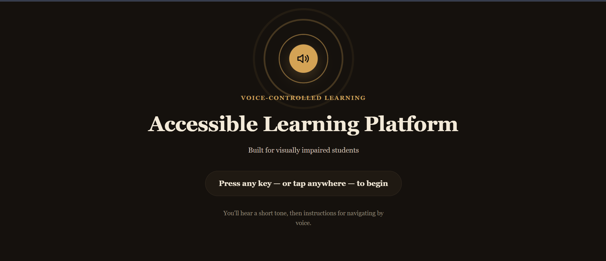

---

### Home Page

Voice-enabled home page that allows users to navigate the platform using speech commands.

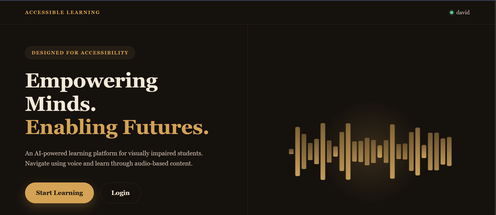

---

### Sign In

Secure authentication page supporting voice-assisted interaction.

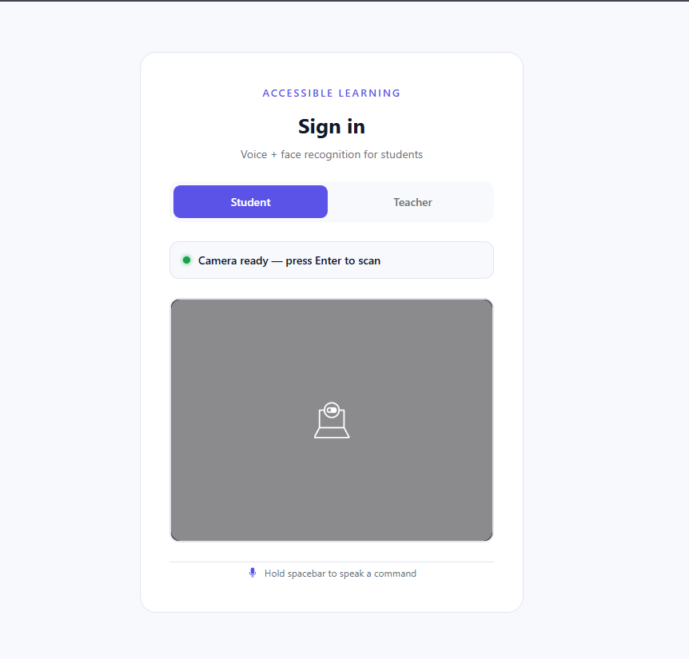

---

### Registration

Student and teacher registration with accessible input mechanisms.

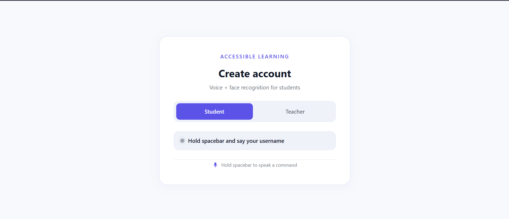

---

### Course Dashboard

Browse and access available learning materials.

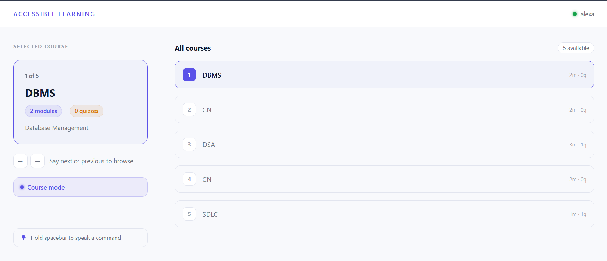

---

### Interactive Quiz

Voice-guided quiz interface for visually impaired learners.

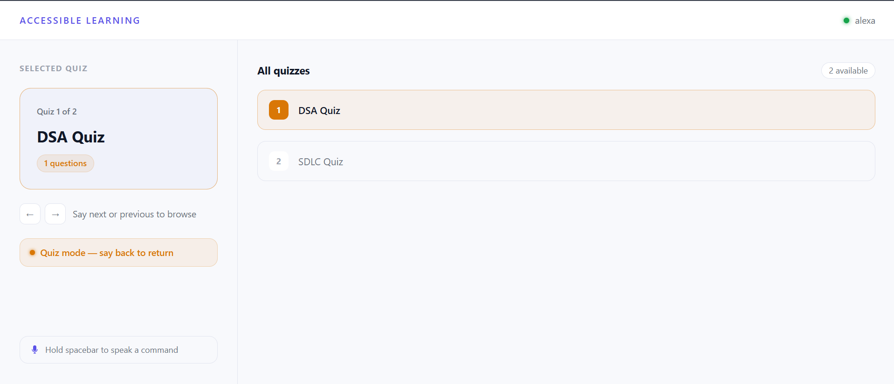

---

### Quiz Result

Instant score evaluation after quiz completion.

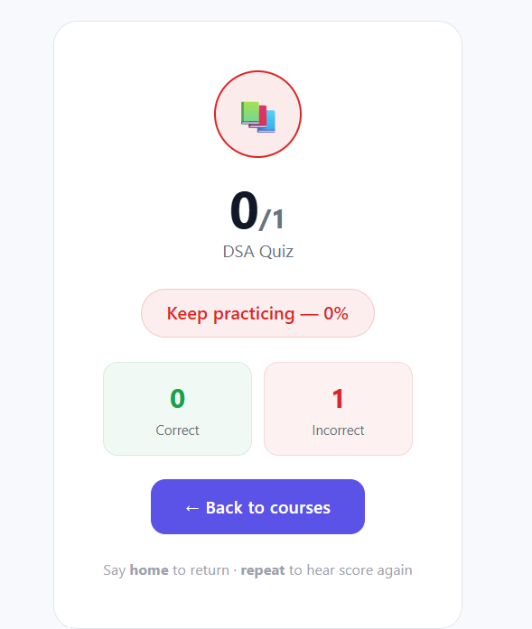

---

## Teacher Dashboard

### Upload Course

Teachers can upload and manage learning content.

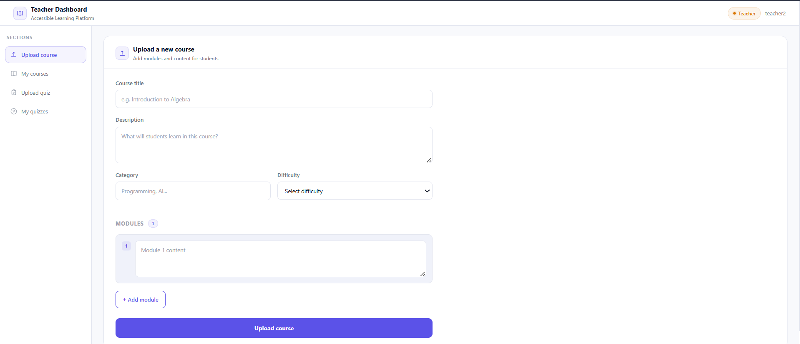

---

### Upload Quiz

Create quizzes for students.

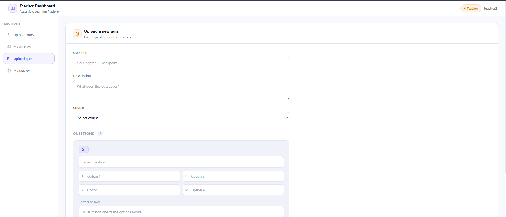

---

### My Courses

Manage previously uploaded courses.

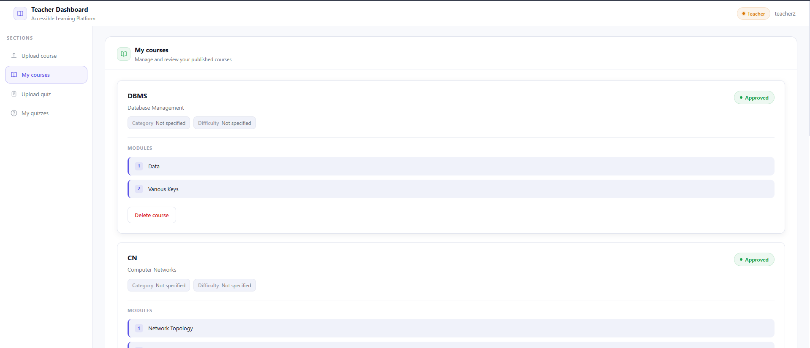

---

### My Quizzes

View and manage created quizzes.

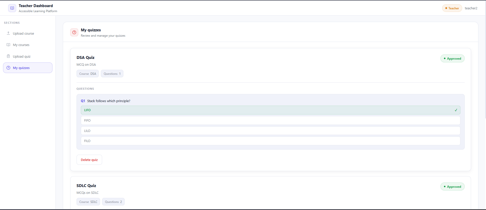

---

## Administrator Portal

### Admin Login

Secure administrator authentication.

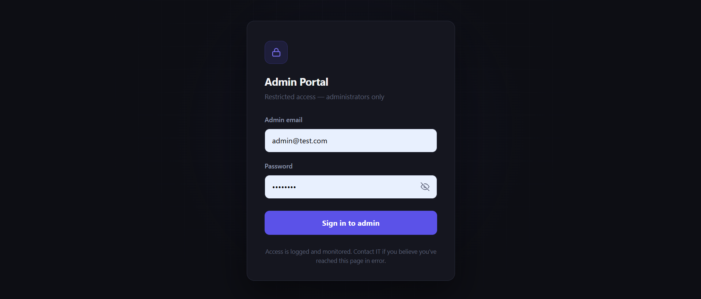

### Admin Dashboard

Approve teachers, courses and quizzes

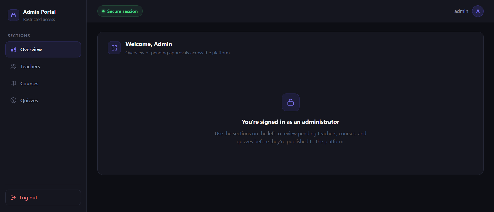


## System Architecture

```
                React Frontend
                       │
                       │ REST APIs
                       ▼
              Express.js Backend
                       │
        ┌──────────────┴──────────────┐
        │                             │
        ▼                             ▼
 MongoDB Atlas                 OpenAI API
        │
        ▼
 Face Recognition Authentication
```

---

## Project Structure

```
Accessible-Learning-Platform/
│
├── backend/
│   ├── config/
│   │   └── db.js
│   ├── models/
│   │   ├── Course.js
│   │   ├── Quiz.js
│   │   └── User.js
│   ├── routes/
│   │   ├── admin.js
│   │   ├── aiRoutes.js
│   │   ├── auth.js
│   │   ├── courses.js
│   │   └── quizzes.js
│   ├── services/
│   │   └── aiService.js
│   ├── index.js
│   └── package.json
│
├── frontend/
│   ├── public/
│   ├── screenshots/
│   │   ├── admin-login-pg.png
│   │   ├── course-pg.png
│   │   ├── home-pg.png
│   │   ├── landing-pg1.png
│   │   ├── quiz-pg.png
│   │   ├── quiz-score.png
│   │   ├── register-pg.png
│   │   ├── signin-pg.png
│   │   ├── teacher-mycourses.png
│   │   ├── teacher-myquizzes.png
│   │   ├── teacher-upload-course.png
│   │   └── teacher-upload-quiz.png
│   │
│   ├── src/
│   │   ├── components/
│   │   │   ├── AdminSidebar.jsx
│   │   │   ├── AIAssistant.jsx
│   │   │   ├── ApproveQuizzes.jsx
│   │   │   ├── TeacherCourses.jsx
│   │   │   ├── TeacherQuizzes.jsx
│   │   │   ├── UploadCourse.jsx
│   │   │   ├── UploadQuiz.jsx
│   │   │   ├── VoiceActivationGate.jsx
│   │   │   └── VoiceFeedback.jsx
│   │   │
│   │   ├── pages/
│   │   │   ├── AdminDashboard.jsx
│   │   │   ├── AdminLogin.jsx
│   │   │   ├── ApproveCourses.jsx
│   │   │   ├── ApproveTeachers.jsx
│   │   │   ├── CourseDetail.js
│   │   │   ├── CourseList.js
│   │   │   ├── Home.js
│   │   │   ├── Login.js
│   │   │   ├── ManageUsers.jsx
│   │   │   ├── Profile.js
│   │   │   ├── QuizPage.jsx
│   │   │   ├── Register.jsx
│   │   │   └── TeacherDashboard.jsx
│   │   │
│   │   ├── utils/
│   │   │   ├── commandUtils.js
│   │   │   └── voiceUtils.js
│   │   │
│   │   ├── App.js
│   │   ├── index.js
│   │   └── App.css
│   │
│   └── package.json
│
└── README.md
```

---

## Application Workflow

1. Users authenticate using face recognition or email/password.
2. Voice navigation allows users to control the platform hands-free.
3. Students access learning modules with speech-assisted guidance.
4. AI Assistant provides summaries, simplified explanations, and examples on demand.
5. Students attempt quizzes and receive instant evaluation.
6. Teachers manage educational resources.
7. Administrators review and approve platform content.

---

## Deployment

### Frontend

- React.js
- Hosted on Vercel

### Backend

- Node.js & Express.js
- Hosted on Render

### Database

- MongoDB Atlas

---

## Installation

### Clone the repository

```bash
git clone https://github.com/Diptadeep-21/Accessible-Learning-Platform-for-Visually-Impaired.git

cd Accessible-Learning-Platform-for-Visually-Impaired
```

### Backend

```bash
cd backend
npm install
npm start
```

### Frontend

```bash
cd frontend
npm install
npm start
```

---

## Future Enhancements

- OCR-based document reading
- Multi-language voice support
- AI-powered personalized tutoring
- Learning analytics dashboard
- Offline accessibility mode
- Real-time collaborative classrooms

---

## Author

**Diptadeep Sinha**

B.Tech Computer Science and Engineering  
Kalinga Institute of Industrial Technology (KIIT)

---

## License

This project is intended for educational and social cause.
